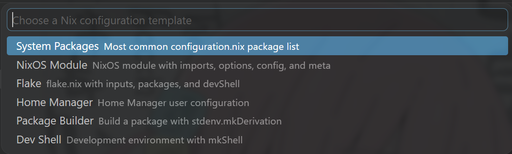

<p align="center">
  
</p>

<h1 align="center">Nix Forge</h1>

<p align="center">
  Focused Nix templates, local import navigation, and formatting for Visual Studio Code.
</p>

<p align="center">
  <a href="https://marketplace.visualstudio.com/items?itemName=ZiYyun.nix-forge">
    
  </a>
  <a href="https://marketplace.visualstudio.com/items?itemName=ZiYyun.nix-forge">
    
  </a>
  <a href="https://github.com/ZiYyyun/vscode-Nix-Forge/stargazers">
    
  </a>
  <a href="LICENSE">
    
  </a>
</p>

<p align="center">
  <a href="#english">English</a> |
  <a href="#中文">中文</a> |
  <a href="#日本語">日本語</a>
</p>

<p align="center">
  
</p>

---

## English

### Focused Templates

Open the command palette with `Ctrl+Shift+P`, run `Nix-Forge: Insert Configuration Template`, or press `Ctrl+Alt+N` in a `.nix` file.

The picker is intentionally small and practical. The first template is the common NixOS package list:

```nix
{ config, pkgs, ... }:

{
  environment.systemPackages = with pkgs; [

  ];
}
```

Built-in templates:

- `NixOS: Install System Packages`: add system-wide packages in `configuration.nix`.
- `NixOS: Import Modules`: create an `imports = [ ... ];` list for local modules.
- `NixOS: Basic Module`: reusable module skeleton with commented `options`, `config`, and `meta`.
- `Flake: NixOS Configuration`: `flake.nix` skeleton for `nixosConfigurations`.
- `Home Manager: User Packages`: user-level `home.packages`.
- `Home Manager: Dotfiles`: manage repository dotfiles through `home.file` and `xdg.configFile`.
- `Package: mkDerivation`: package a source project.
- `Shell: mkShell`: standalone development shell.

Chinese mirror snippets are separate templates and only appear when a Chinese VS Code language pack is installed. They are no longer injected into unrelated templates.

### Import Navigation

Hold `Ctrl` and click a local Nix path, or use `F12` / `Go to Definition`.

```nix
{
  imports = [
    ./hardware-configuration.nix
    ./modules/desktop
    ../shared/users.nix
  ];
}
```

Nix Forge resolves existing files, appends `.nix` when useful, and opens `default.nix` for directory paths. Dynamic expressions such as `<nixpkgs>`, `${...}`, and `modulesPath + "..."` are left to full Nix language servers.

### Formatting

Use `Shift+Alt+F` or run `Nix-Forge: Format Document`.

Nix Forge tries `nixfmt`, `nixpkgs-fmt`, and `alejandra` first. If none are available, it uses a built-in indentation formatter.

### Wiki References

Nix Forge can cache examples from the official NixOS Wiki, but Wiki snippets are hidden by default to keep the picker usable.

```json
{
  "nixLanguageTools.templates.updateFromWikiOnFirstActivation": false,
  "nixLanguageTools.templates.showWikiTemplates": false
}
```

### Project Layout

- `src/extension.ts`: activation entry.
- `src/templates.ts`: template picker and built-in templates.
- `src/formatter.ts`: formatting provider and formatter command handling.
- `src/navigation.ts`: Ctrl+Click / Go to Definition for local Nix paths.
- `src/mirrors.ts`: Chinese binary cache mirror detection and snippet building.
- `src/wikiTemplates.ts`: optional Wiki reference cache.

---

## 中文

### 聚焦常用模板

按 `Ctrl+Shift+P` 打开命令面板，运行 `Nix-Forge: Insert Configuration Template`，或者在 `.nix` 文件里按 `Ctrl+Alt+N`。

模板列表现在会保持精简。第一项就是最常见的 NixOS 安装软件包模板：

```nix
{ config, pkgs, ... }:

{
  environment.systemPackages = with pkgs; [

  ];
}
```

内置模板：

- `NixOS: Install System Packages`：在 `configuration.nix` 里添加系统级软件包。
- `NixOS: Import Modules`：创建本地 module 的 `imports = [ ... ];` 列表。
- `NixOS: Basic Module`：可复用 module 骨架，`options`、`config`、`meta` 都有注释示例。
- `Flake: NixOS Configuration`：用于 `nixosConfigurations` 的 `flake.nix` 骨架。
- `Home Manager: User Packages`：添加用户级 `home.packages`。
- `Home Manager: Dotfiles`：用 `home.file` 和 `xdg.configFile` 管理 dotfiles。
- `Package: mkDerivation`：打包源码项目。
- `Shell: mkShell`：独立开发环境。

>[!NOTE] 关于大陆网络
>
> 中文语言包环境下会额外显示 `NixOS: Configure Binary Cache (China)` / `Flake: Configure Binary Cache (China)`，用于配置国内二进制缓存源，并保留官方 cache 作为备用。

### 导入跳转

按住 `Ctrl` 点击本地 Nix 路径，或者使用 `F12` / `转到定义`。

```nix
{
  imports = [
    ./hardware-configuration.nix
    ./modules/desktop
    ../shared/users.nix
  ];
}
```

Nix Forge 会解析已经存在的文件；必要时会尝试补 `.nix` 后缀；如果路径指向目录，会打开目录里的 `default.nix`。`<nixpkgs>`、`${...}`、`modulesPath + "..."` 这类动态表达式暂时交给完整的 Nix language server 处理。

### 格式化

按 `Shift+Alt+F`，或者运行 `Nix-Forge: Format Document`。

Nix Forge 会优先尝试 `nixfmt`、`nixpkgs-fmt`、`alejandra`。如果都不可用，就使用内置缩进格式化器。

### Wiki 参考

Nix Forge 仍然可以从官方 NixOS Wiki 缓存参考片段，但默认不显示在模板列表里，避免把选择器塞爆。

```json
{
  "nixLanguageTools.templates.updateFromWikiOnFirstActivation": false,
  "nixLanguageTools.templates.showWikiTemplates": false
}
```

### 代码结构

- `src/extension.ts`：扩展启动入口。
- `src/templates.ts`：模板选择器和内置模板。
- `src/formatter.ts`：格式化能力。
- `src/navigation.ts`：本地 Nix 路径 Ctrl+Click / 转到定义。
- `src/mirrors.ts`：国内二进制缓存源测速和换源片段。
- `src/wikiTemplates.ts`：可选 Wiki 参考缓存。

---

## 日本語

### 実用的なテンプレート

`Ctrl+Shift+P` でコマンドパレットを開き、`Nix-Forge: Insert Configuration Template` を実行します。`.nix` ファイルでは `Ctrl+Alt+N` でも使えます。

テンプレート一覧は小さく、実用的なものに絞っています。最初の項目は一般的な NixOS パッケージ一覧です。

```nix
{ config, pkgs, ... }:

{
  environment.systemPackages = with pkgs; [

  ];
}
```

Built-in templates:

- `NixOS: Install System Packages`: `configuration.nix` にシステムパッケージを追加。
- `NixOS: Import Modules`: ローカル module 用の `imports = [ ... ];`。
- `NixOS: Basic Module`: `options`、`config`、`meta` を含む module 雛形。
- `Flake: NixOS Configuration`: `nixosConfigurations` 用の `flake.nix`。
- `Home Manager: User Packages`: ユーザー単位の `home.packages`。
- `Home Manager: Dotfiles`: `home.file` と `xdg.configFile` で dotfiles を管理。
- `Package: mkDerivation`: ソースプロジェクトをパッケージ化。
- `Shell: mkShell`: 開発シェル。

中国向けミラー設定は専用テンプレートに分離されています。

### インポート移動

`Ctrl` を押しながらローカル Nix パスをクリックするか、`F12` / `Go to Definition` を使います。

```nix
{
  imports = [
    ./hardware-configuration.nix
    ./modules/desktop
    ../shared/users.nix
  ];
}
```

既存ファイルを解決し、必要に応じて `.nix` を補完します。ディレクトリの場合は `default.nix` を開きます。

### フォーマット

`Shift+Alt+F`、または `Nix-Forge: Format Document` を実行します。

Nix Forge は `nixfmt`、`nixpkgs-fmt`、`alejandra` を試し、利用できない場合は内蔵フォーマッターを使います。
